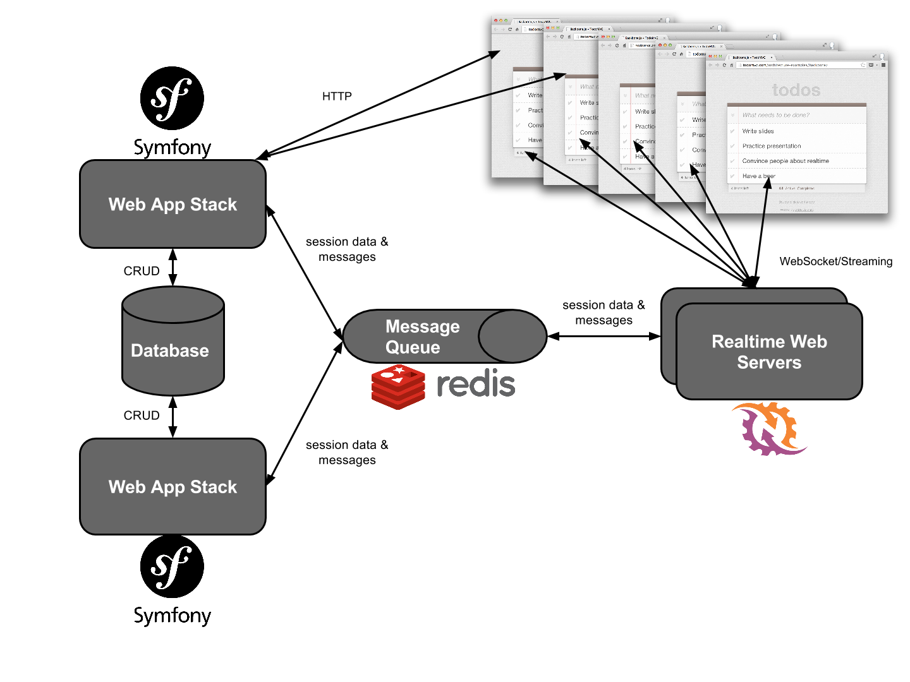
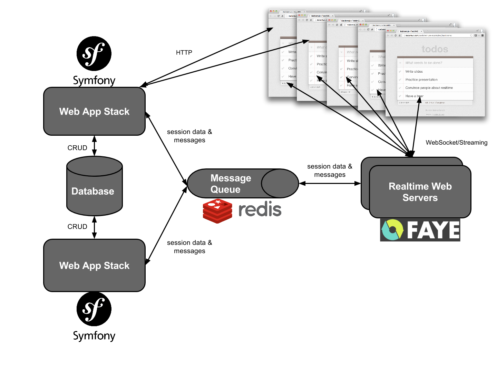
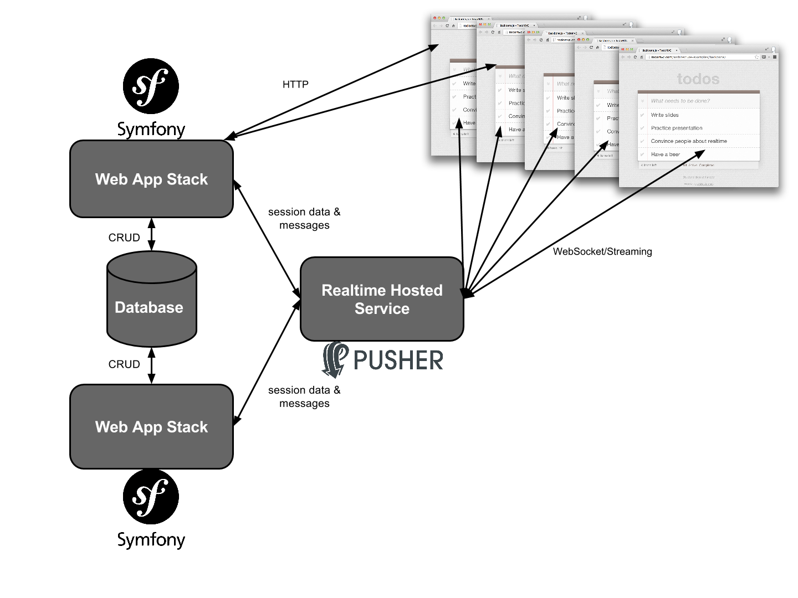

# Real-Time & Symfony Samples

This project demonstrates how to add real-time functionality to a [Symfony](http://symfony.com/) application using three different real-time technologies.

1. [Ratchet (PHP)](http://socketo.me/)
2. [Faye (Node)](http://faye.jcoglan.com)
3. [Pusher (Hosted service)](https://pusher.com)

These samples were originally prepare for a talk at Symfony Live London 2015. You can view the slides here:

* [Real-Time Web Apps & Symfony. What are your options?](http://leggetter.github.io/realtime-symfony/)

## Symfony App Setup

Install the Symfony app dependencies:

```bash
cd symfony
composer install
cd ..
```

If you wish to run the Pusher sample you'll need to create a `app/config/pusher.yml` and [signup](https://pusher.com/signup) for a free account. If you don't wish to run the Pusher sample you will need to remove the `import` from `app/config/config.yml`.

Once the dependencies are installed you'll need to create the database for the sample chat application.

```bash
php symfony/app/console doctrine:database:create
php symfony/app/console doctrine:schema:update --force
```

Run the application:

```bash
php symfony/app/console server:run
```

## Symfony + Ratchet



### Dependencies

For this sample to work you will need [Redis installed](http://redis.io/topics/quickstart).

*Note: Redis only works on \*nix machines*

Install the Ratchet application dependencies:

```
cd ratchet
composer install
cd ..
```

### Code Changes

Messages will be recieved by Ratchet from the Symfony application via Redis (`Symfony -> Redis -> Ratchet`). So, you'll need to uncomment the code that publishes the chat messages to Redis.

Open up `symfony/src/AppBundle/Controller/ChatController.php` and ensure the following is uncommented:

```php
$data = [
  'event' => 'new-message',
  'data' => $message
];
$jsonContent = json_encode($data);
$redis = new Client('tcp://127.0.0.1:6379');
$redis->publish('chat', $jsonContent);
```

### Running the App

Ensure the Symfony application is running:

```bash
php symfony/app/console server:run
```

In a new console/terminal window ensure redis is running:

```bash
redis-server
```

In a new console/terminal run the Ratchet application:

```bash
php ratchet/bin/chat-server.php
```

Navigate to `http://localhost:8000/chat/ratchet`. Open a 2nd browser window so you can see the messages appear in both windows.

## Symfony + Faye



### Dependencies

For this sample to work you will need [Redis installed](http://redis.io/topics/quickstart).

*Note: Redis only works on \*nix machines*

Install the Faye application dependencies:

```
cd faye
npm install
cd ..
```

### Code Changes

Messages will be received by Faye from the Symfony application via Redis (`Symfony -> Redis -> Faye`). So, you'll need to uncomment the code that publishes the chat messages to Redis.

Open up `symfony/src/AppBundle/Controller/ChatController.php` and ensure the following is uncommented:

```php
$data = [
  'event' => 'new-message',
  'data' => $message
];
$jsonContent = json_encode($data);
$redis = new Client('tcp://127.0.0.1:6379');
$redis->publish('chat', $jsonContent);
```

### Running the App

Ensure the Symfony application is running:

```bash
php symfony/app/console server:run
```

In a new console/terminal window ensure redis is running:

```bash
redis-server
```

In a new console/terminal run the Faye application:

```bash
node faye/index.js
```

Navigate to `http://localhost:8000/chat/faye`. Open a 2nd browser window so you can see the messages appear in both windows.

## Symfony + Pusher



### Dependencies

For this sample to work you will need to [signup](https://pusher.com/signup) for a free Pusher account.

### Code Changes

Messages will be sent to Pusher and on to the web browser client via the Pusher service.

Open up `symfony/src/AppBundle/Controller/ChatController.php` and ensure the following is uncommented:

```php
// Uncomment this to use Pusher
// $pusher = $this->container->get('lopi_pusher.pusher');
// $pusher->trigger(
//   'chat',
//   'new-message',
//   $message
// );
```

*Note: If you've previously used the Ratchet or Faye sample then you should comment out the lines that interact with Redis.*

### Running the App

Ensure the Symfony application is running:

```bash
php symfony/app/console server:run
```

Navigate to `http://localhost:8000/chat/pusher`. Open a 2nd browser window so you can see the messages appear in both windows.

## Questions/Feedback

If you've any questions about this sample please [raise and issue](issues/). If you've any more general questions then please email me: phil@pusher.com/phil@leggetter.co.uk.
